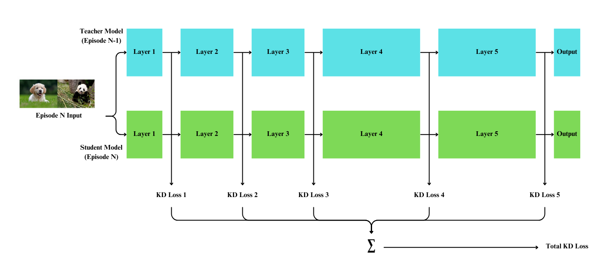

# NICE with Knowledge Distillation (KD)

**Project Title:** NICE with Knowledge Distillation  
**Course:** CS512 (Computer Vision) Final Project at Illinois Institute of Technology  
**Duration:** October 2024 - November 2024  

---

## Introduction

This project integrates **Knowledge Distillation (KD)** with the **NICE (Neurogenesis Inspired Contextual Encoding)** method to enhance its performance in class incremental learning. For detailed insights into the methodology, implementation, and results, refer to the [Project Report](./doc/report.pdf).

---

## Start Guide
### Requirements
- Python 3.8 or above
- PyTorch 1.10 or above
- torchvision
- NumPy
- scikit-learn
- matplotlib

### Installation
Clone the repository:
```bash
git clone https://github.com/seonghwan97/NICE-with-KD.git
cd NICE-with-KD
```

Install dependencies:
```bash
pip install -r ./data/requirements.txt
```

Run the code:
```bash
bash ./src/NICE/run.sh
```

### Additional Resources
- Detailed documentation is available in the [Project Report](./doc/report.pdf) located in the `doc` folder.

---

## Key Features
### 1. NICE Framework
- Dynamic neuron management based on age and importance.
- Replay-free class incremental learning with context detection.
- Context detection using neuron activations and logistic regression.

### 2. Knowledge Distillation Integration
- Teacher-student learning setup for incremental knowledge transfer.
- Soft-label-based output alignment to preserve inter-class relationships.
- Layer-wise distillation loss computation for precise guidance.

### 3. Incremental Learning Adaptation
- Supports MNIST and CIFAR-10 datasets.
- Effectively addresses catastrophic forgetting.
- Improved task accuracy compared to baseline NICE.

### 4. Performance Visualization
- Accuracy and loss tracking across episodes.
- Detailed analysis through confusion matrices and feature maps.
- Visualization of layer-wise neuron utilization over episodes.

---

## References
- Gurbuz, M. B., Moorman, J. M., & Dovrolis, C. (2024). NICE: Neurogenesis Inspired Contextual Encoding for Replay-free Class Incremental Learning. Proceedings of the IEEE/CVF Conference on Computer Vision and Pattern Recognition (CVPR). [Link to Paper](https://openaccess.thecvf.com/content/CVPR2024/html/Gurbuz_NICE_Neurogenesis_Inspired_Contextual_Encoding_for_Replay-free_Class_Incremental_Learning_CVPR_2024_paper.html)
- Official NICE GitHub Repository: [NICE Implementation](https://github.com/BurakGurbuz97/NICE.)

This README is concise but includes essential sections for an academic project. Feel free to tweak it or